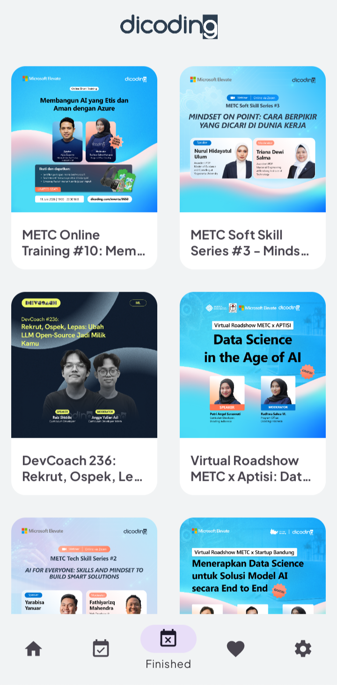
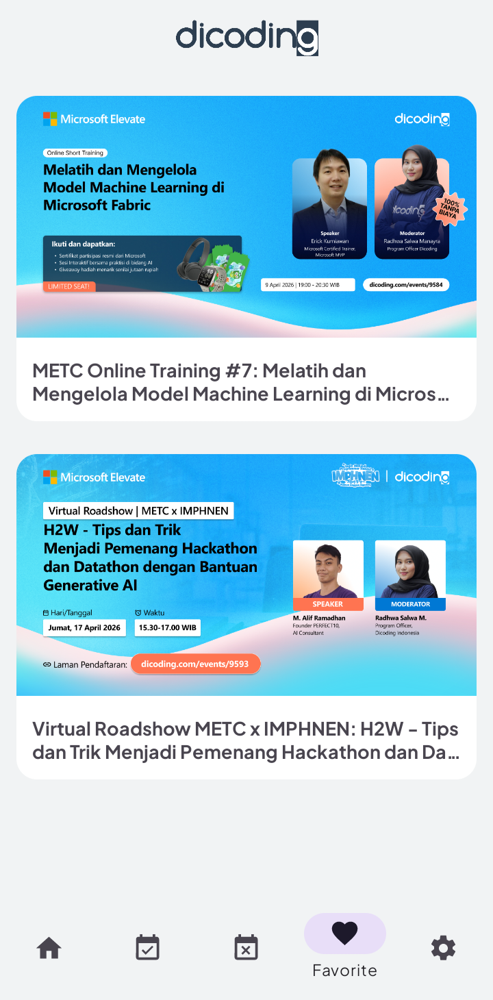
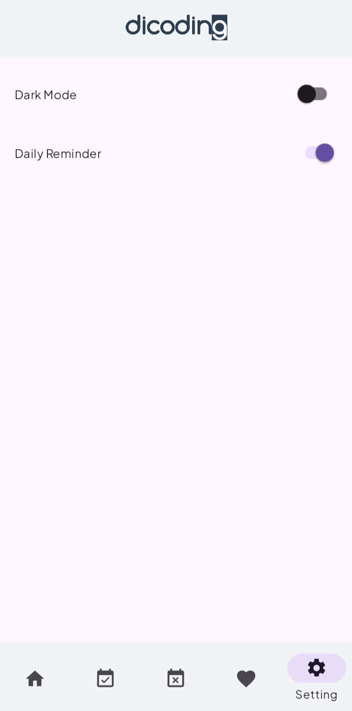

# Dicoding Events

[](https://developer.android.com/)
[](https://kotlinlang.org/)
[](https://developer.android.com/topic/architecture)
[](LICENSE)

**Dicoding Events** adalah aplikasi Android untuk mencari, membaca, dan menyimpan informasi event dari **Dicoding Event API**. Aplikasi ini dibuat dengan pendekatan **MVVM + Repository** dan menampilkan event **upcoming**, **finished**, **favorite**, detail event, pengaturan tema, serta daily reminder notification.

## Portfolio Overview

Project ini dirancang sebagai aplikasi event tracker yang sederhana namun lengkap, dengan fokus pada:

- pengalaman navigasi yang rapi lewat **Bottom Navigation**
- pengambilan data dari API secara real-time
- penyimpanan data favorit secara lokal
- pengaturan tema dan reminder yang persisten
- tampilan detail event yang informatif dan mudah dipakai

## Screens

Simpan aset screenshot di folder `docs/screenshots/` agar rapi dan mudah dihubungkan ke README GitHub.

| Screenshot                                 | Page     | Explanation                                                              |
|--------------------------------------------|----------|--------------------------------------------------------------------------|
|          | Home     | Menampilkan ringkasan upcoming dan finished event, serta fitur pencarian |
|  | Upcoming | Daftar event yang akan datang                                            |
|  | Finished | Daftar event yang sudah selesai                                          |
|  | Favorite | Daftar event favorit yang disimpan secara lokal                          |
|    | Setting  | Pengaturan dark mode dan daily reminder                                  |
|      | Detail   | Informasi lengkap event, cover image, dan tombol registrasi              |

## Key Features

- Menampilkan event dari API Dicoding
- Pencarian event dari halaman Home
- Favorit event menggunakan **Room Database**
- Dark mode menggunakan **DataStore Preferences**
- Daily reminder menggunakan **WorkManager**
- Navigasi antar halaman menggunakan **Navigation Component**
- Loading gambar event menggunakan **Glide**
- Splash screen modern saat aplikasi dibuka

## Tech Stack

- **Kotlin**
- **Android SDK**
- **Android Jetpack**
  - ViewModel
  - LiveData
  - Navigation Component
  - Room
  - DataStore
  - WorkManager
  - Fragment KTX
  - SplashScreen
- **Material Design**
- **View Binding**
- **Retrofit + OkHttp**
- **Gson Converter**
- **Glide**

## Library

| Library                                       |  Version | Fungsinya                                 |
|-----------------------------------------------|---------:|-------------------------------------------|
| `androidx.core:core-ktx`                      | `1.18.0` | Kotlin extension untuk Android core       |
| `androidx.appcompat:appcompat`                |  `1.7.1` | Dukungan UI kompatibel untuk Activity     |
| `com.google.android.material:material`        | `1.13.0` | Komponen UI Material Design               |
| `androidx.activity:activity`                  | `1.13.0` | Dukungan Activity modern                  |
| `androidx.constraintlayout:constraintlayout`  |  `2.2.1` | Layout fleksibel dan responsif            |
| `androidx.recyclerview:recyclerview`          |  `1.4.0` | Menampilkan daftar event                  |
| `androidx.cardview:cardview`                  |  `1.0.0` | Card UI untuk item list                   |
| `androidx.fragment:fragment-ktx`              |  `1.8.9` | Kotlin extension untuk Fragment           |
| `androidx.lifecycle:lifecycle-viewmodel-ktx`  | `2.10.0` | ViewModel dengan coroutine support        |
| `androidx.lifecycle:lifecycle-livedata-ktx`   | `2.10.0` | Observasi data UI secara reactive         |
| `androidx.navigation:navigation-fragment-ktx` |  `2.9.7` | Navigasi antar fragment                   |
| `androidx.navigation:navigation-ui-ktx`       |  `2.9.7` | Integrasi Navigation dengan UI            |
| `androidx.core:core-splashscreen`             |  `1.2.0` | Splash screen modern                      |
| `androidx.room:room-runtime`                  |  `2.8.4` | Database lokal untuk favorit              |
| `androidx.room:room-ktx`                      |  `2.8.4` | Support coroutine untuk Room              |
| `androidx.room:room-compiler`                 |  `2.8.4` | Annotation processor Room via KSP         |
| `androidx.work:work-runtime-ktx`              | `2.11.2` | Menjalankan reminder harian di background |
| `androidx.datastore:datastore-preferences`    |  `1.2.1` | Menyimpan preferensi tema dan reminder    |
| `com.squareup.retrofit2:retrofit`             |  `3.0.0` | HTTP client untuk API request             |
| `com.squareup.retrofit2:converter-gson`       |  `3.0.0` | Parsing JSON ke Kotlin model              |
| `com.squareup.okhttp3:logging-interceptor`    |  `5.3.2` | Logging request dan response API          |
| `com.github.bumptech.glide:glide`             |  `5.0.5` | Load dan cache gambar dari URL            |

## Project Architecture

Struktur aplikasi mengikuti pola **MVVM + Repository**:

- **View**: `MainActivity`, `HomeFragment`, `UpcomingFragment`, `FinishedFragment`, `FavoriteFragment`, `SettingFragment`, `DetailActivity`
- **ViewModel**: mengelola state UI dan data yang ditampilkan
- **Repository**: `EventRepository` sebagai penghubung data remote dan local
- **Remote Data**: `ApiService`, `ApiConfig`
- **Local Data**: `EventDatabase`, `EventDao`, `FavoriteEvent`
- **Preferences**: `SettingPreferences`
- **Worker**: `DailyReminderWorker`

## API Reference

Base URL:

```text
https://event-api.dicoding.dev/
```

Endpoint yang digunakan:

| Endpoint                | Fungsi                                |
|-------------------------|---------------------------------------|
| `GET /events?active=1`  | Mengambil daftar upcoming event       |
| `GET /events?active=0`  | Mengambil daftar finished event       |
| `GET /events?q=keyword` | Mencari event berdasarkan kata kunci  |
| `GET /events/{id}`      | Mengambil detail event berdasarkan ID |

## Permissions

| Permission           | Fungsi                                         |
|----------------------|------------------------------------------------|
| `INTERNET`           | Mengakses Dicoding Event API                   |
| `POST_NOTIFICATIONS` | Menampilkan notifikasi reminder di Android 13+ |

## Minimum Requirements

- **Min SDK**: 24
- **Target SDK**: 36
- **Compile SDK**: 36
- **Java Compatibility**: 11

## How to Run

1. Clone repository ini.
2. Buka project di **Android Studio**.
3. Tunggu proses **Gradle Sync** selesai.
4. Jalankan aplikasi ke emulator atau device Android.

## Project Structure

```text
app/src/main/java/com/example/dicoding_events/
├── data/
│   ├── local/
│   ├── preference/
│   ├── remote/
│   └── repository/
├── ui/
│   ├── detail/
│   ├── favorite/
│   ├── finished/
│   ├── home/
│   ├── setting/
│   └── upcoming/
└── worker/
```

## Why This Project Stands Out

- Menggabungkan data **online** dan **offline** dalam satu aplikasi
- Memiliki pengalaman pengguna yang sederhana dan jelas
- Mendukung personalisasi lewat tema dan reminder
- Cocok sebagai portfolio project Android karena mencakup banyak komponen Jetpack penting

## License

Project ini menggunakan **MIT License**. Lihat file [`LICENSE`](LICENSE) untuk detail lengkap.

